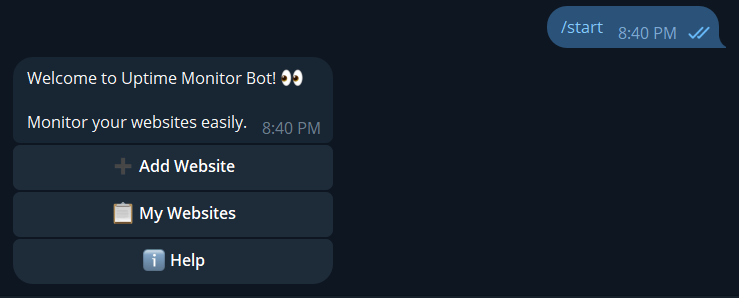
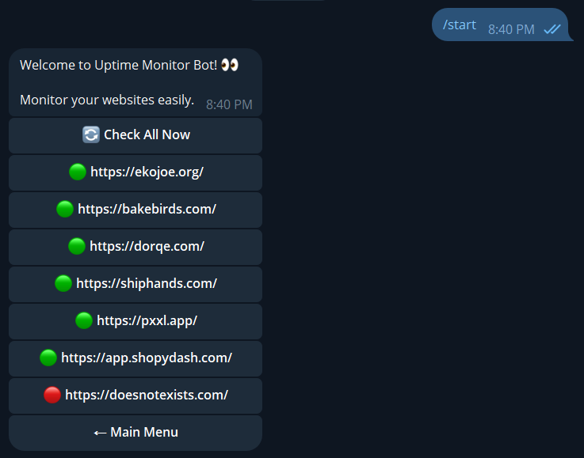
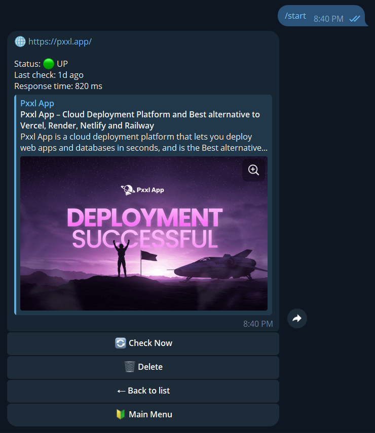
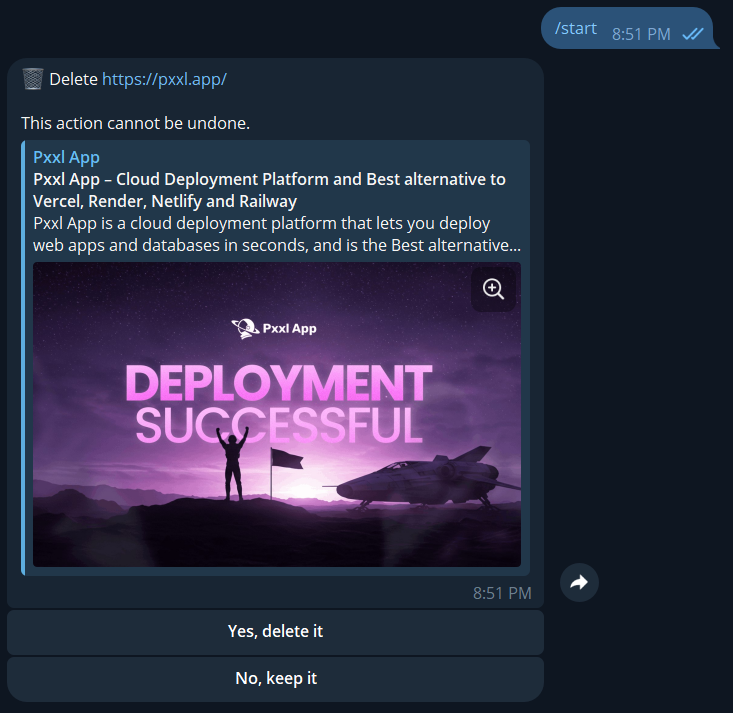

# Nest Telegram Uptime Bot

[](https://opensource.org/licenses/MIT)
[](https://nodejs.org)
[](https://nestjs.com)
[](https://grammy.dev)
[](https://github.com/ekojoecovenant/nest-telegram-uptime-bot/actions)
[](https://pxxl.app)

A Telegram bot that monitors website uptime and status. Add your sites, get instant checks, see real-time status (🟢 up / 🔴 down), and receive detailed error reasons when things go wrong.

Built with **NestJS**, **grammY**, **TypeORM** + **PostgreSQL**, and **Axios**.

## Features

- Add HTTPS websites via guided conversation
- View your list of sites with live status emojis
- On-demand "Check Now" for single sites or "Check All" for full reports
- Detailed views: response time, last check (relative time), downtime reasons (e.g. 503, timeout, DNS failure)
- Delete confirmation to prevent accidents
- Clean single-message navigation (edits instead of spamming replies)
- Webhook support for production (polling for local dev)
- Deployed-ready (tested on pxxl.app)

## Screenshots / Demo

### Main Menu (/start)



### My Websites List



### Detail View



## Delete Confirmation



## Tech Stack

- **Backend Framework**: NestJS (v10+)
- **Telegram Bot API**: grammY + @grammyjs/menu + @grammyjs/conversations
- **Database/ORM**: TypeORM + PostgreSQL
- **HTTP Checks**: Axios
- **Deployment**: pxxl.app (webhook mode)

## Prerequisites

- Node.js 18+
- PostgreSQL (local or hosted)
- Telegram Bot Token (create bot via [@BotFather](https://t.me/BotFather))

## Setup & Run Locally

1. Clone the repo

    ```bash
    git clone https://github.com/ekojoecovenant/nest-telegram-uptime-bot.git
    cd nest-telegram-uptime-bot
    ```

2. Install dependencies

    ```bash
    npm install
    ```

3. Copy and configure .env

    ```bash
    cp .env.example .env
    ```

    Fill in:

    ```text
    TELEGRAM_BOT_TOKEN=your-bot-token-from-botfather

    DB_URL='your-database-url' (local or online. Postgres recommended)

    # Optional for webhook (production)
    TELEGRAM_WEBHOOK_URL=https://your-domain.com (the url this app will be hosted)
    TELEGRAM_WEBHOOK_PATH=/bot-webhook
    ```

4. Start in development mode (polling)bash

    ```bash
    npm run start:dev
    ```

The bot should come online — talk to it on Telegram!

## Deployment (pxxl.app or similar)

1. Push code to GitHub / Git repo
2. In pxxl.app dashboard:
    - Create new service from Git repo
    - Set runtime: Node.js
    - Add environment variables (from your `.env`)
    - Expose port (usually 3000 or whatever `main.ts` listens on)
    - Enable webhook mode by setting `TELEGRAM_WEBHOOK_URL` to your pxxl domain (e.g. `https://your-bot.pxxl.pro`)
3. Deploy — bot should auto-set webhook on startup

**Note**: Make sure `pxxl.app` gives you a stable HTTPS URL. If webhook fails, run manually:

```text
https://api.telegram.org/bot<YOUR_TOKEN>/setWebhook?url=https://your-domain.pxxl.pro/bot-webhook
```

## Customization

- Change status emojis: edit `getStatusEmoji()` in `my-websites.menu.ts`
- Adjust check timeout: `axios.head(..., { timeout: 10000 })` in `monitor.service.ts`
- Add more status reasons: expand `lastErrorReason` logic in `monitor.service.ts`
- Enable periodic checks (future): add `@nestjs/schedule` cron job

## Project Structure

```text
src/
├── bot/                # Telegram bot logic (service, menus, conversations)
│   ├── menus/
│   ├── conversations/
│   └── types.ts
├── config/             # Postgres Database Configuration
├── domain/             # TypeORM entities (User, Website)
├── user-website/       # Service for managing user ↔ website relations
├── monitor/            # Uptime checking logic
├── health/             # Simple health check endpoint
├── utils/              # Shared utility functions
└── main.ts             # App bootstrap
```

## Contributing

See CONTRIBUTING.md for guidelines.

## License

MIT License — see LICENSE for details.
Feel free to fork, modify, and use in your own projects!

Made with 🤍 by [@ekojoecovenant](https://x.com/ekojoecovenant)
